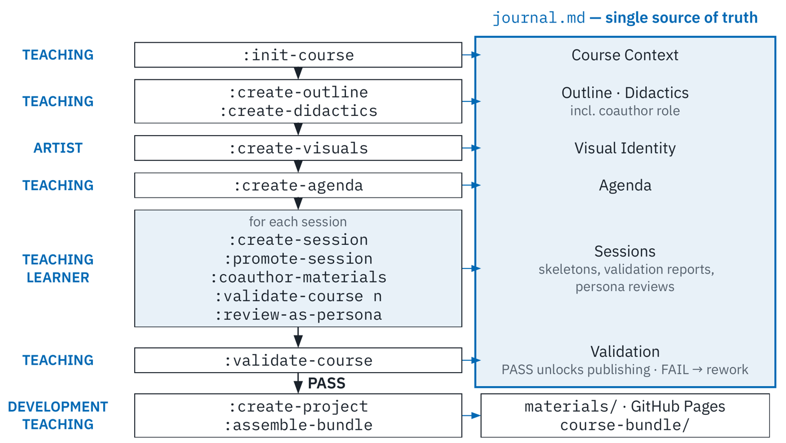

<!--
version:  0.2.0
language: de

narrator: Deutsch Female

tags: Vortrag, KI, Agenten, LiaScript, OER, Hochschuldidaktik

comment:  Wenn aus dem Chatbot ein Team wird — Agentische KI in der
          Hochschullehre. Impuls beim HDS-Symposium „KI in der Lehre“,
          Klosterhof St. Afra, Meißen.
          Vortragender: Sebastian Zug (TU Bergakademie Freiberg).

author:   Sebastian Zug

import: https://raw.githubusercontent.com/LiaTemplates/LiveEdit-Embeddings/refs/tags/0.0.1/README.md

persistent: true

edit: true

@style
.cols {
  display: flex;
  flex-wrap: wrap;
  align-items: center;
  justify-content: space-between;
  gap: 2rem;
}

.cols > * {
  flex: 1;
  min-width: 280px;
}
@end

-->

[](https://liascript.github.io/course/?https://raw.githubusercontent.com/LiaPlayground/HDS_2026_KI_Rollen/main/vortrag.md)

# Wenn aus dem Chatbot ein Team wird

<h2>Agentische KI in der Hochschullehre</h2>

<div class="cols">
<div>

<h4>Prof. Dr. Sebastian Zug</h4>

<h4>TU Bergakademie Freiberg, Institut für Informatik</h4>

> __HDS-Symposium „KI in der Lehre — Zwischen Transformation, Verantwortung und didaktischer Gestaltung“__
>
> __Klosterhof St. Afra, Meißen, 29. September 2026__

</div>
<div>

[qr-code](https://liascript.github.io/course/?https://raw.githubusercontent.com/LiaPlayground/HDS_2026_KI_Rollen/main/vortrag.md)

</div>
</div>

---

Dieser Foliensatz steht unter einer Creative-Commons-Lizenz (CC BY 4.0). Der Quelltext liegt auf [GitHub](https://github.com/LiaPlayground/HDS_2026_KI_Rollen).


--{{0}}--
Sehr geehrte Damen und Herren, in den folgenden zwanzig Minuten möchte ich
zeigen, dass „KI in der Lehre“ Unterschiedliches bedeuten kann – abhängig
davon, welche Rolle wir der KI zuweisen und aus welcher Perspektive wir sie
betrachten.


## Rollen der KI in der Lehre

> __Wie setzen Lehrende und Lernende KI heute ein — und welche Rollen fehlen noch?__

<div class="cols">
<div>

**Für Lehrende**

     {{0-1}}
| Unterstützung durch die KI                            | Studienlage¹               |
| ----------------------------------------------------- | -------------------------- |
| schlägt Einstiege, Beispiele und Methoden vor         | ✅ 37–63 %²                |
| erstellt Materialien, Aufgaben und Quizze             | ⚠️ nicht getrennt erfasst² |
| schärft Lernziele und Constructive Alignment          | ✅ 19–32 %                 |
| bearbeitet Aufgabenblätter als simulierte Studierende | ❌ nicht erhoben           |
| …                                                     |                            |

     {{1}}
| Unterstützung durch die KI                            | Rolle der KI             |
| ----------------------------------------------------- | ------------------------ |
| schlägt Einstiege, Beispiele und Methoden vor         | **Ideengeber**           |
| erstellt Materialien, Aufgaben und Quizze             | **Generator**            |
| schärft Lernziele und Constructive Alignment          | **Didaktischer Berater** |
| bearbeitet Aufgabenblätter als simulierte Studierende | **Tester**               |
| …                                                     |                          |

</div>
<div>


**Für Lernende**

     {{0-1}}
| Unterstützung durch die KI             | Studienlage¹                              |
| -------------------------------------- | ----------------------------------------- |
| erklärt Inhalte und beantwortet Fragen | ✅ 42–67 %                                |
| fragt ab und erzeugt Übungsaufgaben    | ✅ 43–53 %                                |
| gibt Feedback auf Struktur und Sprache | ⚠️ häufiger: KI schreibt selbst (27–64 %) |
| spielt Kundin, Patient oder Mandantin  | ❌ nicht erhoben                          |
| …                                      |                                           |

     {{1}}
| Unterstützung durch die KI             | Rolle der KI           |
| -------------------------------------- | ---------------------- |
| erklärt Inhalte und beantwortet Fragen | **Digitaler Tutor**    |
| fragt ab und erzeugt Übungsaufgaben    | **Übungspartner**      |
| gibt Feedback auf Struktur und Sprache | **Schreibpartner**     |
| spielt Kundin, Patient oder Mandantin  | **Rollenspielpartner** |
| …                                      |                        |

</div>
</div>

     {{0-1}}
<small>✅ verbreitet · ⚠️ nur indirekt erfasst · ❌ in keiner Studie erhoben —
¹ Anteil der Befragten laut Review von Bosse, Wannemacher & Lübcke (2026) über
15 Studien. ² Gemeinsame Kategorie „Planung & Vorbereitung“.</small>

     {{2}}
> [!TIP]
> **Wer KI einsetzt, muss ihre Rolle konkret benennen — erst mit diesem Verständnis lässt sich deren Unterstützung effizient nutzen.**

     {{3}}
> [!IMPORTANT]
> **Lehrende brauchen mehrere Rollen, die sie unterstützen, Lernende mehrere, die sie fördern und fordern — aus dem Chatbot wird ein Team.**

--{{0}}--
Am Anfang steht eine Bestandsaufnahme. Elke Bosse und ihre Kolleginnen und
Kollegen haben fünfzehn Befragungen an deutschen Hochschulen ausgewertet;
morgen werden wir dazu mehr hören. Lehrende setzen KI vor allem in der
Vorbereitung ein, Studierende nutzen sie, um sich Inhalte erklären zu lassen
und zu üben. Aufschlussreich ist, was fehlt: KI als Testperson für ein
Aufgabenblatt oder als Rollenspielpartner wird in keiner der Studien erhoben.
Zudem lassen Studierende die KI häufiger selbst Texte verfassen, als dass sie
Rückmeldung zu eigenen Texten einholen.

--{{1}}--
Benennt man diese Tätigkeiten, werden daraus Rollen: Ideengeber, Generator,
didaktischer Berater und Tester auf Seiten der Lehrenden – Tutor,
Übungspartner, Schreibpartner und Rollenspielpartner auf Seiten der
Studierenden.

--{{2}}--
Daraus ergibt sich eine erste These: Die Rolle ist keine Eigenschaft des
Modells, sondern eine Entscheidung, die wir treffen. Erst wenn sie benannt
ist, lässt sich bestimmen, welche Erwartungen wir haben, welchen Kontext wir
bereitstellen und woran wir das Ergebnis messen. Der Wissenschaftsrat
empfiehlt, die Rollen von Lehrenden und Lernenden neu zu bestimmen. Ich möchte
ergänzen: Dies gilt auch für die Rolle der KI.

--{{3}}--
Die zweite These: Eine einzelne Rolle genügt selten. Lehrende benötigen
mehrere Rollen, die sie unterstützen, Studierende mehrere, die sie fördern und
fordern. Aus dem Chatbot wird so ein Team.

## Agenda

**Unser Weg durch die nächsten 20 Minuten**

     {{0}}
1. **Materialgenerierung: KI als Kollegin der Lehrenden** — vom einzelnen
   Prompt zum Team aus Agenten
2. **Teamtraining: KI als Kollegin der Studierenden** — ein Semester mit vier
   KI-Teammitgliedern

> Zweimal ein Team aus vier Agenten und Menschen — mit entgegengesetzter
> Wirkung: Es entlastet die Lehrenden und fordert die Studierenden heraus.

--{{0}}--
Ich gehe in zwei Schritten vor. In beiden Fällen ist die KI nicht ein
einzelner Chatbot, sondern ein Team von jeweils vier Agenten mit festen Rollen
– zunächst bei der Materialerstellung im Team der Lehrenden, anschließend im
Teamtraining im Team der Studierenden. Dabei wird deutlich, wie
unterschiedlich dieselbe Idee wirken kann.

# KI-Agenten bei der Materialgenerierung

> **Bevor wir die Agenten „von der Leine lassen“, müssen wir KI-günstige Bedingungen schaffen.**

--{{0}}--
Zunächst zu den Lehrenden und zu einer praktischen Frage: Bevor Agenten ganze
Lernmodule erstellen, müssen die Rahmenbedingungen stimmen. Die erste dieser
Bedingungen ist das Format.

## Stufe 1 - Perspektivenwechsel

> [!IMPORTANT]
> **Materialgenerierung: Texte sind die Ausgabe von KIs — die Frage ist, in welchem Format und in welchem Team.**


<div class="cols">
<div>

```
Generiere ein Aufgabenblatt zum Ohmschen Gesetz für  
einen Physik Grundkurs als ...`
```

<!-- data-type="none" -->
| Zielformat         | erzeugte Tokens |
| ------------------ | --------------: |
| Word direkt        |   1.604 – 2.524 |
| Word per Programm  |       673 – 923 |
| PDF (über LaTeX)   |       474 – 566 |
| Markdown           |       325 – 351 |

</div>
<div>

{{1-3}}
```
Generiere ein digitales Aufgabenblatt zum Ohmschen Gesetz für  
einen Physik Grundkurs als ...`
```

{{1-2}}
<!-- data-type="none" -->
| Zielformat        | erzeugte Tokens |
| ----------------- | --------------: |
| SCORM-Paket       |   1.657 – 2.487 |
| Moodle-Quiz (XML) |     503 – 1.387 |
| ...               |                 |
| ?                 |                 |

{{2-3}}
<!-- data-type="none" -->
| Zielformat           | erzeugte Tokens |
| -------------------- | --------------: |
| SCORM-Paket          |   1.657 – 2.487 |
| Moodle-Quiz (XML)    |     503 – 1.387 |
| ...                  |                 |
| LiaScript ohne Hilfe |       325 – 465 |

</div>
</div>

--{{0}}--
Für die folgende Untersuchung haben wir der KI stets denselben Auftrag erteilt
– ein Aufgabenblatt zum Ohmschen Gesetz mit genau festgelegtem Inhalt – und
lediglich das Zielformat variiert. Getestet wurden vier Modelle auf drei
Plattformen: bei Google, auf der Academic Cloud der GWDG und auf einem
hochschuleigenen Rechner. Gemessen haben wir die Zahl der Tokens, die die KI
dafür erzeugen muss; der Inhalt selbst umfasst rund 280. Soll die KI eine
Word-Datei unmittelbar schreiben, benötigt sie bis zu 2.500 Tokens, und nahezu
keine dieser Dateien ließ sich öffnen. Der Umweg über ein Programm ist
günstiger, setzt jedoch voraus, dass jemand dieses Programm ausführt – und er
scheiterte in mehr als der Hälfte der Fälle. Ein PDF über LaTeX erfordert
knapp 500, Markdown gut 300 Tokens; beide gelangen in jedem Durchlauf.

--{{1}}--
Anders stellt sich die Lage dar, wenn das Aufgabenblatt digital und interaktiv
sein soll, also Eingaben prüft, Hinweise gibt und Ergebnisse an das
Lernmanagementsystem meldet. Ein SCORM-Paket erfordert rund 2.000 Tokens, da
jede Prüfung als Programmcode formuliert werden muss, und funktionierte nur in
gut der Hälfte der Fälle. Ein Moodle-Quiz ließ sich lediglich in einem Drittel
der Fälle importieren. Es stellt sich daher die Frage, ob es ein Format gibt,
das so schlank ist wie Markdown und dennoch Interaktivität erlaubt.

--{{2}}--
Ein solches Format ist LiaScript. Es benötigt gut 300 Tokens – kaum mehr als
der Inhalt selbst und in derselben Größenordnung wie statisches Markdown.

--{{3}}--
Zur Einordnung gehört eine Einschränkung: Ohne Unterstützung kennen die
Modelle die LiaScript-Syntax nicht hinreichend und scheitern. Mit einer
Kurzreferenz von fünf Zeilen im Auftrag gelang die Erstellung hingegen in
allen achtzehn Durchläufen und bei jedem Modell. Wie das Ergebnis aussieht,
zeige ich im Folgenden.

## Das Übungsblatt in LiaScript

> __LiaScript ist Markdown — erweitert um genau die Elemente, die für interaktive Lehre fehlen.__

<small>Seit 2018 an der TU Bergakademie Freiberg entwickelt (Dietrich 2019).
Heute: 3.317 offene Kurse von 314 Autor:innen auf GitHub (Zug et al. 2026).</small>

```markdown @embed.style(height: 600px; min-width: 100%; border: 1px black solid)
# Übungsblatt 3: Ohmsches Gesetz

Das Ohmsche Gesetz beschreibt folgenden Zusammenhang zwischen Spannung $U$, Widerstand $R$ und Strom $I$.

$$U = R \cdot I$$

__Verständnisfrage:__ Wie ändert sich der Strom, wenn der
Widerstand bei gleicher Spannung verdoppelt wird?

- [( )] Er verdoppelt sich.
- [(X)] Er halbiert sich.
- [( )] Er bleibt gleich.

??[Ohmsches Gesetz – Simulation](https://www.falstad.com/circuit/circuitjs.html?startCircuit=ohms.txt)

```

     {{1}}
> [!TIP]
> **Direkt in OPAL:** LiaScript-Kurse lassen sich nahtlos in OPAL einbinden —
> ohne Export und ohne Programmierkenntnisse.
> [Anleitung im OPAL-Kurs „LiaScript meets OPAL“](https://bildungsportal.sachsen.de/opal/auth/RepositoryEntry/28960423936?4)

--{{0}}--
Links steht der Quelltext, rechts das Ergebnis: eine Formel, ein Quiz mit
automatischer Rückmeldung und eine eingebettete Schaltungssimulation, die
lediglich eine Zeile Text erfordert. Änderungen im Quelltext werden
unmittelbar in der Darstellung sichtbar.

--{{1}}--
Für die sächsischen Hochschulen ist zudem relevant, dass sich solche Kurse
ohne weiteren Aufwand in OPAL einbinden lassen. Eine Anleitung steht in OPAL
selbst zur Verfügung.

## Stufe 2: Ein Prompt ist kein Team

> __Ein einzelner Prompt liefert *irgendein* Material. Gutes Lehrmaterial entsteht im Zusammenspiel von Fachwissen, Didaktik, Gestaltung und dem Blick der Lernenden.__

| Typisches Muster im KI-Rohentwurf  | Warum problematisch                       |
| ---------------------------------- | ----------------------------------------- |
| Formal korrekt, didaktisch flach   | Definition statt Verständnis              |
| Quiz prüft Auswendiglernen         | „Wie heißt das Verfahren?“ statt Transfer |
| Beispiel ohne Bezug zur Zielgruppe | Abstrakte Zahlen statt Anwendung          |

     {{1}}
> [!IMPORTANT]
> **Das Format löst das technische Problem. Wir brauchen aber auf der inhaltlichen Ebene Unterstützung aus unterschiedlichen Kompetenzfeldern.**

--{{0}}--
Das offene Format löst jedoch nur einen Teil der Aufgabe. Ein einzelner
Auftrag an die KI liefert zwar ein Ergebnis, dieses ist aber häufig formal
korrekt und didaktisch flach.

--{{1}}--
Das Format löst das technische Problem. Inhaltlich bedarf es der Unterstützung
aus mehreren Kompetenzfeldern: Fachwissen, Didaktik, Gestaltung und die
Perspektive der Lernenden. Der Wissenschaftsrat spricht in diesem Zusammenhang
von „Meta-Arbeit“: KI-generierte Inhalte müssen fachlich geprüft werden. Offen
ist, wer diese Prüfung übernimmt – an dieser Stelle wird die KI vom Werkzeug
zur Kollegin.

## Agenten mit didaktischen Rollen

> __Der Teaching-Agent verteilt die Kurserstellung auf vier Rollen — die Lehrenden entscheiden.__

<small>Vergleich einfacher und agentischer Kurserstellung mit LiaScript:
Dietrich, Hyadi, Aubel, Göhler, Domsch & Zug (DELFI 2026).</small>

| Agent          | Rolle der KI                  | Aufgabe                                          |
| -------------- | ----------------------------- | ------------------------------------------------ |
| 🎓 Teaching    | **Kollege** (Didaktiker)      | Lernziele, Constructive Alignment, Struktur      |
| 🎨 Artist      | **Werkzeug** (Gestaltung)     | visuelle Identität, Bilder, Layout               |
| 🧑‍🎓 Learner     | **Studierender** (Testperson) | prüft Material aus Sicht einer Lernenden-Persona |
| 🛠️ Development | **Werkzeug** (Technik)        | Syntax, Git, Veröffentlichung                    |

     {{1}}


     {{2}}
> [!TIP]
> **Selbst ausprobieren:**
> [LiaScript Teaching-Agent auf GitHub](https://github.com/LiaScript/teaching-agent)
> — läuft in Claude Code, GitHub Copilot, Codex, Cursor u. a.

     {{3}}
> [!TIP]
> **Zu viel Technik?**
> Im Rahmen einer OE_Sprints-Förderung des BMFTR wird der Teaching-Agent im
> Projekt LiaAgent (2026–2027) zu einem grafischen Werkzeug weiterentwickelt.
> Partner ist das KIT, Zentrum für Mediales Lernen.

--{{0}}--
Der Teaching-Agent, entwickelt von André Dietrich, verteilt die Erstellung
eines Kurses auf vier Rollen. Die KI fungiert hier als didaktische Kollegin,
als Werkzeug für Gestaltung und Technik sowie als simulierte Studierende, die
das Material prüft, bevor es eingesetzt wird.

--{{1}}--
Der Ablauf ist schrittweise angelegt: zunächst Kontext und Lernziele,
anschließend Didaktik, Gestaltung und die einzelnen Einheiten, schließlich
eine Validierung, bevor Inhalte veröffentlicht werden. Sämtliche Ergebnisse
werden in einem gemeinsamen Projektjournal dokumentiert. Die Syntax-Referenz,
die im Experiment den Ausschlag gab, ist fester Bestandteil des Verfahrens.
Die Freigabe erfolgt durch die Lehrenden.

--{{2}}--
Das Werkzeug ist quelloffen und in allen gängigen agentischen
Arbeitsumgebungen einsetzbar.

--{{3}}--
Da dieser Zugang für viele Lehrende noch zu technisch ist, entwickeln wir ihn
im Projekt LiaAgent gemeinsam mit dem Karlsruher Institut für Technologie zu
einem grafischen Werkzeug weiter. Interessierte, die ihr Fach einbringen
möchten, lade ich herzlich zur Mitwirkung ein.

# KI als Kollegin der Studierenden

> [!IMPORTANT]
> **Teamskills sind wichtig - aber wie trainiert man diese in der akademischen Ausbildung?**

+ der Lernerfolg ist vom Zufall der Teamstruktur abhängig
+ die Nachbildung von realen Abläufen des Berufslebens kann wegen der Lehr-Lern-Situation nicht gelingen
+ die Reflexion aus Sicht der Lehrenden ist wegen des fehlenden Einblicks schwierig

> [!IMPORTANT]
> **Idee:** Wir stellen ein berufsbildspezifisches Team durch KI-Agenten nach. Anspruchsvolle Chefs, überpenible Kollegen, erwartungsvolle Kunden ... so dass alle Studierenden die gleichen Randbedingungen haben.

> [!NOTE]
> Abbruch in Programmierkursen
> (Hawlitschek et al. 2019) · Unterstützung in Online-Laboren
> (Hawlitschek et al. 2022) · Teamarbeit in der Lehre (Hawlitschek et al.
> 2021, 2022, 2023) · KI-Kompetenz von Studierenden (Göhler 2025) ·
> KI-Agenten im Team (Göhler et al. 2026)

<h4>Volker Göhler, Simon Hörtzsch, Sebastian Zug (TU Bergakademie Freiberg) · Anja Hawlitschek (OVGU Magdeburg)</h4>

--{{0}}--
Ich wechsle nun die Perspektive. Teamfähigkeit ist in nahezu jedem Berufsfeld
gefordert; ihre Vermittlung im Studium ist jedoch schwierig. Der Lernerfolg
hängt von der zufälligen Zusammensetzung der Gruppen ab, berufliche Abläufe
lassen sich kaum realistisch nachbilden, und Lehrende erhalten nur begrenzten
Einblick in die Prozesse innerhalb der Teams. Meine Kollegen Volker Göhler und
Simon Hörtzsch verfolgen daher einen anderen Ansatz: Sie bilden ein
berufstypisches Team mit KI-Agenten nach – mit einer anspruchsvollen
Projektleitung, einer strengen Prüferin, einem fehleranfälligen Praktikanten
und einem Auftraggeber mit unklaren Anforderungen. Auf diese Weise arbeiten
alle Studierenden unter denselben Bedingungen. Das Vorhaben ist Teil einer
Forschungslinie, die wir seit 2019 verfolgen. Die Ergebnisse sind vorläufig;
die ausführliche Publikation befindet sich in der Begutachtung.


## Vier KI-Teammitglieder

> __Die Agenten arbeiten nicht im Chatfenster, sondern auf der Projektplattform des Kurses: Sie verteilen Aufträge, prüfen Abgaben und liefern selbst Arbeit ab.__

|            | Rolle            | Was sie tut                                               | Was die Studierenden dabei lernen          |
| ---------- | ---------------- | --------------------------------------------------------- | ------------------------------------------ |
| **Maria**  | Projektleiterin  | verteilt Arbeitsaufträge, gibt Tipps                      | Aufträge verstehen und abarbeiten          |
| **Lisa**   | Prüferin         | prüft jede Abgabe — und kann sie zurückweisen             | mit Kritik umgehen, nachbessern            |
| **Kevin**  | Praktikant       | arbeitet nur nach Aufträgen der Studierenden — mit Fehlern | genau beauftragen, fremde Arbeit prüfen    |
| **Jürgen** | Auftraggeber     | äußert vage, teils widersprüchliche Wünsche               | Anforderungen klären, auch Nein sagen      |

     {{1}}
> [!NOTE]
> **Kevin ist der didaktisch wichtigste Agent:** Wer ihn beauftragt, muss genau
> beschreiben, was gebraucht wird — und das Ergebnis anschließend prüfen.

--{{0}}--
Die vier Agenten tragen gewöhnliche Vornamen und haben jeweils eine feste
Rolle. Maria leitet das Projekt und verteilt die Aufgaben. Lisa prüft jede
Abgabe und kann sie zurückweisen; in diesem Fall muss nachgebessert werden.
Jürgen tritt als Auftraggeber mit vagen Wünschen auf, von denen nicht alle
sinnvoll sind.

--{{1}}--
Kevin übernimmt die Rolle des Praktikanten. Er arbeitet ausschließlich nach
Aufträgen, die die Studierenden selbst formulieren, und seine Ergebnisse
enthalten Fehler. Die Studierenden lernen so, Aufgaben präzise zu beauftragen
und Ergebnisse zu prüfen. Genau dies bezeichnet der Wissenschaftsrat als Meta-
Arbeit – hier wird sie zum Gegenstand des Lernens.

## Übertragbar auf Ihr Fach?

> __Im Laufe des Semesters wechseln die Studierenden die Rolle: vom Selbermachen zum Beauftragen und Prüfen.__

     {{1}}
| Rolle der KI           | Bauingenieurwesen               | Öffentliche Verwaltung               | Lehrerbildung                            |
| ---------------------- | ------------------------------- | ------------------------------------ | ---------------------------------------- |
| **Projektleitung**     | Bauleiterin verteilt Aufgaben   | Referatsleiterin weist Vorgänge zu   | Mentorin plant die Unterrichtsreihe      |
| **Prüferin**           | Prüfstatikerin weist Plan zurück | Vorgesetzte zeichnet Bescheid nicht mit | Fachseminarleiterin prüft den Entwurf  |
| **Praktikant**         | fehlerhafte Mengenermittlung    | fehlerhafter Bescheidentwurf         | unausgereifter Stundenentwurf            |
| **Auftraggeber**       | Bauherr mit vagen Wünschen      | Bürgerin mit unklarem Anliegen       | Schulleitung mit neuen Vorgaben          |

     {{2}}
> [!NOTE]
> **Datenschutz:** Alles läuft auf Servern der Universität. Keine Daten der
> Studierenden gehen an kommerzielle KI-Anbieter.

--{{0}}--
Im Verlauf des Semesters arbeiten die Studierenden zunächst selbst und werden
von Lisa geprüft. Später kehrt sich das Verhältnis um: Sie beauftragen Kevin
und prüfen seine Arbeit. Diese Kompetenz gewinnt mit dem Einsatz von KI in
nahezu allen Berufen an Bedeutung.

--{{1}}--
Der Ansatz ist nicht auf die Informatik beschränkt. Denkbar sind etwa eine
Prüfstatikerin, die einen Plan zurückweist, ein fehlerhafter Bescheidentwurf
in der Verwaltung oder eine Schulleitung mit neuen Vorgaben. Jede dieser
Rollen ließe sich durch einen Agenten übernehmen.

--{{2}}--
Für den Einsatz in der Lehre ist ein weiterer Punkt wesentlich: Die KI läuft
auf Servern der Universität mit einem offenen Modell; Daten der Studierenden
verlassen die Hochschule nicht. Dies entspricht der Empfehlung des
Wissenschaftsrates, souveräne KI-Infrastrukturen sowie offene oder europäische
Modelle anstelle proprietärer Dienste zu nutzen.

## Wem vertrauen die Studierenden?

> __Alle Befragten bewerteten alle vier Agenten. Wer erhielt das höchste Vertrauen?__

<!-- data-type="barchart" data-show data-title="Vertrauen in die Agenten (−2 bis +2, n = 7)" -->
| Agent                   | Mittelwert |
| ----------------------- | ---------: |
| Maria (Projektleiterin) |       0.63 |
| Lisa (Prüferin)         |       0.06 |
| Jürgen (Auftraggeber)   |      −0.29 |
| Kevin (Praktikant)      |      −0.37 |

     {{1}}
**Lisa polarisiert:** Werte von −1,8 bis +1,8 — ein Mittelwert nahe null aus
zwei Lagern.

     {{1}}
> „Durch den Eingriff der Betreuer wirkte Lisa menschlicher — sie entwickelte
> eine Art Ego.“

     {{2}}
**Kevin wird geschätzt, *weil* er Fehler macht:**

     {{2}}
> „Kevin ist nur so gut wie die Anweisungen, die man ihm gibt.“

--{{0}}--
Maria erhält das höchste Vertrauen, Kevin das geringste. Ausschlaggebend ist
dabei nicht die Kompetenz, sondern die Abhängigkeit: Marias Hinweise sind ohne
Aufwand nutzbar, Kevins Ergebnisse müssen korrigiert werden.

--{{1}}--
Besonders aufschlussreich ist Lisa. Ihr Mittelwert liegt nahe null, dahinter
verbergen sich jedoch zwei Lager: Für einen Teil der Studierenden ist sie das
realistischste Element des Kurses, für andere der Grund, weshalb sie eine
Woche lang nicht vorankamen.

--{{2}}--
Kevin wird schlecht bewertet und zugleich verteidigt – gerade weil sein
Verhalten den Anforderungen des späteren Berufslebens entspricht.

## Und die Tutor-Rolle?

> __Für uns ist die KI Tutor, für die Studierenden Kollegin — dieselbe Technik, zwei Rollen.__

Aus Sicht der **Lehrenden** übernimmt Lisa klassische Tutorenarbeit - wir nennen es aber nicht so! Sie

- prüft jede Abgabe und gibt den nächsten Aufgabenteil frei
- erste Rückmeldung im Median nach **etwas über einer Stunde**
- in einer ausgewerteten Übung: 14 Prüfrunden, 12 davon mit
  Nachbesserungsbedarf; 11 Freigaben durch Lisa, **2 durch menschliche Tutoren**

     {{1}}
> [!CAUTION]
> Die Studierenden wünschen sich einen **„Frag-deinen-Tutor“-Knopf** und eine
> manuelle Freigabe bei Blockaden. Eine unberechenbare Prüferin ist etwas
> anderes als eine strenge.

--{{0}}--
Aus Sicht der Lehrenden übernimmt Lisa Aufgaben einer Tutorin: Sie prüft
Abgaben und gibt Aufgaben frei, im Median nach etwa einer Stunde. Menschliche
Tutorinnen und Tutoren mussten nur selten eingreifen.

--{{1}}--
Die Studierenden wünschen sich allerdings eine menschliche Ansprechperson für
den Fall einer Blockade. Da das System im Verlauf des Semesters angepasst
wurde, erlebten sie Lisa zudem teilweise als inkonsistent. Der
Wissenschaftsrat warnt davor, Betreuung an Chatbots auszulagern; die
Rückmeldungen der Studierenden weisen in dieselbe Richtung.

# Was bleibt?

> [!IMPORTANT]
> **Lassen Sie uns KI als vielschichtige Mitstreiterin verstehen und nutzen — dieselbe Teamidee wirkt dabei unterschiedlich: Sie entlastet Lehrende und fordert Studierende heraus.**

|                         | Materialgenerierung                              | Teamtraining                                                  |
| ----------------------- | ------------------------------------------------ | ------------------------------------------------------------- |
| **Team von …**          | Lehrenden                                        | Studierenden                                                  |
| **Vier Agenten**        | Didaktikerin, Gestalter, Testperson, Technik     | Projektleiterin, Prüferin, Praktikant, Auftraggeber           |
| **Wer prüft wen?**      | Testperson prüft das Material der Didaktikerin   | Prüferin prüft Studierende, Studierende prüfen den Praktikanten |
| **Warum KI?**           | Didaktische Beratung fehlt für die meisten Lehrveranstaltungen | Erfahrene Rollen können Studierende einander nicht vorspielen |
| **Wirkung**             | ergänzt und entlastet                            | fordert heraus — gelernt wird an der Reibung                  |
| **Wer entscheidet?**    | Lehrende geben frei                              | Studierende beauftragen und prüfen                            |

     {{1}}
> [!NOTE]
> **Intellektuelle Souveränität** (Wissenschaftsrat 2026): selbstbestimmt denken
> und urteilen — auch, indem man bequeme Vereinfachung hinterfragt. Rollen, in
> denen Studierende KI beauftragen, prüfen und ihr widersprechen, üben genau das.

>  [!QUESTION]
>  Vielen Dank für das Interesse. Ich freue mich auf die Diskussion mit Ihnen.

--{{0}}--
In beiden Beispielen haben wir nicht einen einzelnen Chatbot gesehen, sondern
ein Team von Agenten. Für Lehrende ergänzt es fehlende Expertise und schafft
Entlastung. Für Studierende stellt es eine Herausforderung dar – gelernt wird
gerade an der Reibung. In beiden Fällen liegt die Entscheidung beim Menschen.

--{{1}}--
Der Wissenschaftsrat beschreibt intellektuelle Souveränität als die Fähigkeit,
selbstbestimmt zu denken und zu urteilen, und als Haltung, die bequeme
Vereinfachungen hinterfragt. Rollen, in denen Studierende die KI beauftragen,
ihre Ergebnisse prüfen und ihr widersprechen müssen, fördern genau diese
Haltung. Ich danke Ihnen für Ihre Aufmerksamkeit und freue mich auf die
Diskussion.

## Literatur

**Eigene Arbeiten** (TU Bergakademie Freiberg)

- Dietrich, A., Hyadi, J., Aubel, I., Göhler, V., Domsch, H. & Zug, S. (2026). *LiaScript as an AI-Ready Authoring Format: Comparing Skill-Based and Agentic Course Generation.* DELFI 2026, GI, 487–490. [doi:10.18420/delfi2026_53](https://doi.org/10.18420/DELFI2026_53)
- Zug, S., Dietrich, A., Aubel, I., Lommatzsch, M. & Göhler, V. (2026). *Designed but Not Used? A Feature Adoption Analysis of LiaScript Courses.* DELFI 2026, GI, 179–192. [doi:10.18420/delfi2026_17](https://doi.org/10.18420/DELFI2026_17)
- Göhler, V., Hörtzsch, S., Zug, S. & Hawlitschek, A. (2026). *Integrating AI Agents and Repository Systems in Software Development Education.* DELFI 2026, GI. [doi:10.18420/delfi2026_33](https://doi.org/10.18420/DELFI2026_33)
- Göhler, V. (2025). *Critical or Confident? AI Literacy and Student–AI Collaboration in Higher Education.* SIGCITE '25, ACM, 119–126. [doi:10.1145/3769694.3771145](https://doi.org/10.1145/3769694.3771145)
- Hawlitschek, A., Rudolf, G., Berndt, S. & Zug, S. (2023). *Automated alerts to avoid unfavourable interaction patterns in collaborative learning: Which design do students prefer?* DELFI 2023, GI. [doi:10.18420/delfi2023-33](https://doi.org/10.18420/delfi2023-33)
- Hawlitschek, A., Rudolf, G. & Zug, S. (2022). *Informatikstudierende als Teamplayer. Wie die Integration von Teamarbeit in die Lehre gelingen kann.* DELFI 2022, GI. [doi:10.18420/delfi2022-019](https://doi.org/10.18420/delfi2022-019)
- Hawlitschek, A., Dietrich, A. & Zug, S. (2022). *Effects of different types of guidance on students' motivation and learning in a remote laboratory in computer science.* Computer Science Education 33(3), 375–399. [doi:10.1080/08993408.2022.2029046](https://doi.org/10.1080/08993408.2022.2029046)
- Hawlitschek, A., Rudolf, G. & Zug, S. (2021). *Herausforderungen bei der Integration von Teamarbeit in die Lehre am Beispiel einer Lehrveranstaltung aus der Informatik.* DELFI 2021, GI.
- Hawlitschek, A., Köppen, V., Dietrich, A. & Zug, S. (2019). *Drop-out in programming courses – prediction and prevention.* Journal of Applied Research in Higher Education 12(1), 124–136. [doi:10.1108/JARHE-02-2019-0035](https://doi.org/10.1108/JARHE-02-2019-0035)
- Dietrich, A. (2019). *LiaScript: A Domain-Specific-Language for Interactive Online Courses.* Proc. Int. Conf. e-Learning 2019, 186–194. [doi:10.33965/el2019_201909f024](https://doi.org/10.33965/el2019_201909f024)

**Weitere Quellen**

- Bassner, P., Lenk-Ostendorf, B., Beinstingel, R., Wasner, T. & Krusche, S. (2026). *Less stress, better scores, same learning: The dissociation of performance and learning in AI-supported programming education.* Computers and Education: AI 10, 100537. [doi:10.1016/j.caeai.2025.100537](https://doi.org/10.1016/j.caeai.2025.100537)
- Bosse, E., Wannemacher, K. & Lübcke, M. (2026). *Die KI-Nutzung in Studium und Lehre. Review auf Grundlage empirischer Studien.* HFD-Arbeitspapier 91. [PDF](https://hochschulforumdigitalisierung.de/wp-content/uploads/2026/01/HFD_AP_91_Review_KI-Nutzung_in_Studium_und_Lehre.pdf)
- Wissenschaftsrat (2026). *Intellektuelle Souveränität: Empfehlungen für die Hochschulbildung in Zeiten von generativer KI.* Drs. 3319-26, Köln. [doi:10.57674/1evx-t906](https://doi.org/10.57674/1evx-t906)

--{{0}}--
Die Arbeiten, auf die sich dieser Beitrag stützt, sind hier aufgeführt und
über den QR-Code auch im Vortrag selbst abrufbar.

# Vielen Dank!

<h2>„Aus einem Chatbot wird ein Team, wenn wir jeder KI eine Rolle geben.“</h2>

<div class="cols">
<div>

**Ein Team, zwei Seiten**

1. **KI-Team der Lehrenden** — ergänzt und entlastet bei der Materialgenerierung
2. **KI-Team der Studierenden** — fordert heraus im Teamtraining

Aus der Rolle folgen Erwartung, Kontext, Befugnisse und Verlässlichkeit.

</div>
<div>

<center>

**Alles zum Mitnehmen**

[qr-code](https://liascript.github.io/course/?https://raw.githubusercontent.com/LiaPlayground/HDS_2026_KI_Rollen/main/vortrag.md "Vortrag und Token-Experiment")

</center>

</div>
</div>

> **Fragen?**
>
> **Prof. Dr. Sebastian Zug** · [sebastian.zug@informatik.tu-freiberg.de](mailto:sebastian.zug@informatik.tu-freiberg.de)
>
> TU Bergakademie Freiberg · Institut für Informatik
